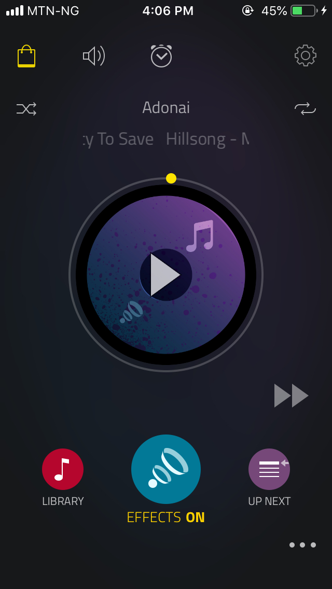

# JukeBox
Boom Music clone implementated in React Native

## Installation
- Clone the repository and run `react-native init`
- Then run `react-native run-ios` to build and run the application

## Inspiration
- Inspired by [Boom Music App](https://apps.apple.com/us/app/boom-music-player-equalizer/id1065511007)

## Note
- This application is only being developed for iOS platform only.
